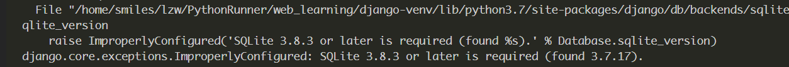
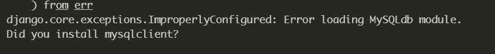
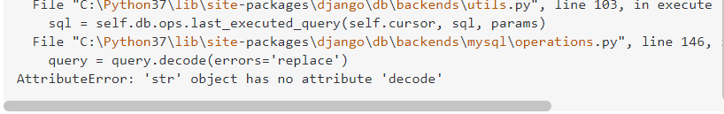

# 学习笔记

## Centos7 中 Django2 和 SQLite3 版本冲突问题

centos7 中默认安装的 SQLite3 版本是 3.7.17，但是 Django2 需要 3.8.3 或之后的版本，因此使用 Django2 运行项目会抛出错误



### 解决办法

修改 SQLite3 版本

- [Using SQLite3 with Django 2.2 and Python 3.6.7 on Centos7
  ](https://stackoverflow.com/questions/55485858/using-sqlite3-with-django-2-2-and-python-3-6-7-on-centos7)

## Centos7 中 Django2 使用 Mysql 时报错

当我将 Django 中的默认数据库切换为 Mysql 并尝试运行时报错，提醒我需要安装 mysqlclient



根据提示安装 mysqlclient，报错，寻求 Google 的帮助，需要安装一些额外的组件

```python
yum install python-devel mysql-devel
yum search python3 | grep devel

# 安装对应版本的组件
yum install python3-devel.x86_64

# 最后重新安装 mysqlclient
pip install mysqlclient
```

成功运行！

- [解決在 Django + MySQL + Python3 在 CentOS7 上找不到 mysqlclient 的問題](https://medium.com/@maotingyang/%E8%A7%A3%E6%B1%BA%E5%9C%A8-django-mysql-python3-%E5%9C%A8-centos7%E4%B8%8A%E6%89%BE%E4%B8%8D%E5%88%B0-mysqlclient-%E7%9A%84%E5%95%8F%E9%A1%8C-845978a33013)
- [mysqlclient 官方安装文档](https://github.com/PyMySQL/mysqlclient-python)
- [解决 python3-devel 问题](https://stackoverflow.com/questions/43047284/how-to-install-python3-devel-on-red-hat-7)

## Windows10 上安装 mysqlclient

mysqlclient 在 windows 上的安装比较困难，即便是官方也没有给出详细步骤，不过可以通过下载 whl 文件到本地进行安装

- [Windows 下 Django(Python3)使用 Mysqlclient 配置并连接 Mysql](https://www.jianshu.com/p/03503d6dd4be)
- [Unofficial Windows Binaries for Python Extension Packages](https://www.lfd.uci.edu/~gohlke/pythonlibs/)

## 生成数据库文件的时候报错



### 解决方法

- [Migrations error in django 2; AttributeError: 'str' object has no attribute 'decode'
  ](https://stackoverflow.com/questions/56820895/migrations-error-in-django-2-attributeerror-str-object-has-no-attribute-dec)
